# HR-Automated-Database-Structure

## Introduction:
Creating a Human Resources (HR) automated database record for an FMCG company called OBZ foods using MySQL DBMS which enters and preserves every staff record, their salary and allowance information, and maintain an accurate audit trail.

**_Disclaimer_**: _This is a self-developed data record, for an imaginary company and names randomly formulated._

## Step1:

Creating staff record for four departments
- Logistics department (01)
- Warehouse department (02)
- Production department (03)
- Human Resources department (04)
Each table structure for the department will contain;
- Firstname and Lastname of each staff
- Qualification of each staff
- Year of employment of each staff
- Position held by each staff 
- Gender disaggregated column
- Staff Identity Number (Staff_Id) which will be a combination of year of employment, department code, and staff serial number.

**creating Database**
          
          CREATE DATABASE obzdb;
          
          USE obzdb;
          
**creating table entry for Logistics department**
      
      CREATE TABLE logis_dept (
          sn INT NOT NULL AUTO_INCREMENT UNIQUE,
          firstname VARCHAR(20),
          lastname VARCHAR(20) NOT NULL,
          qualification ENUM(‘degree’, ‘ssce’, ‘p6’)
          year_of_employment INT NOT NULL, 
          depart_no INT NOT NULL DEFAULT 01,
          position VARCHAR(20) NOT NULL DEFAULT ‘staff’,
          gender ENUM(‘m’, ‘f’) );
 
      INSERT INTO logis_dept (
          firstname, lastname, qualification, year_of_employment, position, gender)
      VALUES 
          (‘Daniel’, ‘Agba’, ‘degree’, 2014, ‘manager’, ‘m’),
          (‘Ibak’, ‘Daniel’, ‘ssce’, 2014, ‘staff’, ‘m’),
          (‘Abigail’, ‘Ikono’, ‘ssce’, 2014, ‘staff’, ‘f’),
          (‘Ada’, ‘Basil’, ‘ssce’, 2014, ‘staff’, ‘f’),
          (‘Anne’, ‘Chinwe’, ‘degree’, 2014, ‘supervisor’, ‘f’),
          (‘Chidimma’, ‘Cutee’, ‘ssce’, 2014, ‘staff’, ‘f’),
          (‘Chinasa’, ‘Adline’, ‘p6’, 2014, ‘staff’, ‘f’),
          (‘micheal’, ‘Nwanga’, ‘p6’, 2014, ‘staff’, ‘m’),
          (‘Anthony’, ‘Ofoma’, ‘p6’, 2014, ‘staff’, ‘m’),
          (‘Gerald’, ‘Ray’, ‘p6’, 2014, ‘staff’, ‘m’),
          (‘Ojo’, ‘Oluwase’, ‘p6’, 2015, ‘staff’, ‘m’),
          (‘Harry’, ‘Breno’, ‘p6’, 2015, ‘staff’, ‘m’),
          (‘Ihenacho’, ‘Chidinma’, ‘p6’, 2015, ‘staff’, ‘f’),
          (‘Happy’, ‘Omege’, ‘p6’, 2015, ‘staff’, ‘m’),
          (‘Obiageli’, ‘Mbonu’, ‘p6’, 2015, ‘staff’, ‘f’);

**creating table entry for warehouse department**

    CREATE TABLE ware_dept (
        sn INT NOT NULL AUTO_INCREMENT PRIMARY KEY,
        firstname VARCHAR(20),
        lastname VARCHAR(20) NOT NULL,
        qualification ENUM(‘degree’, ‘ssce’, ‘p6’)
        year_of_employment INT NOT NULL, 
        depart_no INT NOT NULL DEFAULT 01,
        position VARCHAR(20) NOT NULL DEFAULT ‘staff’,
        gender ENUM(‘m’, ‘f’) );

     INSERT INTO ware_dept (
         firstname, lastname, qualification, year_of_employment, position, gender)
      VALUES
        (‘Adachi’, ‘Katie’, ‘degree’, 2014, ‘supervisor’, ‘f’),
        (‘Adaeze’, ‘Precious’, ‘degree’, 2014, ‘staff’, ‘f’),
        (‘Adetunji’, ‘Badejo’, ‘degree’, 2014, ‘manager’, ‘m’),
        (‘Lilly’, ‘Igwe’, ‘degree’, 2014, ‘staff’, ‘f’),
        (‘Bassey’, ‘Okori’, ‘ssce’, 2014, ‘staff’, ‘m’),
        (‘Peter’, ‘Okezie’, ‘ssce’, 2014, ‘staff’, ‘m’),
        (‘Innocent’, ‘Ekpo’, ‘ssce’, 2015, ‘staff’, ‘m’),
        (‘Thomas’, ‘Enya’, ‘ssce’, 2015, ‘staff’, ‘m’),
        (‘Eniola’, ‘Gold’, ‘ssce’, 2015, ‘staff’, ‘f’),
        (‘Ugochi’, ‘Eze’, ‘p6’, 2015, ‘staff’, ‘f’),
        (‘Chris’, ‘Frank’, ‘p6’, 2016, ‘staff’, ‘m’),
        (‘Faruk’, ‘Sani’, ‘p6’, 2016, ‘staff’, ‘m’),
        (‘Felix’, ‘Ogbenu’, ‘p6’, 2016, ‘staff’, ‘m’),
        (‘Gloria’, ‘Essein’, ‘p6’, 2016, ‘staff’, ‘f’),
        (‘Blessing’, ‘Njoku’, ‘p6’, 2016, ‘staff’, ‘f’),
        (‘Hillary’, ‘Bernard’, ‘p6’, 2016, ‘staff’, ‘m’),
        (‘Cynthia’, ‘Omani’, ‘ssce’, 2016, ‘staff’, ‘m’),
        (‘Prince’, ‘Basiru’, ‘ssce’, 2016, ‘staff’, ‘m’),
        (‘Tonia’, ‘Igboko’, ‘ssce’, 2016, ‘staff’, ‘f’),
        (‘Udochi’, ‘Uzoh’, ‘degree’, 2016, ‘supervisor’, ‘m’);
        
**creating table entry for production department**

    CREATE TABLE prod_dept (
        sn INT NOT NULL AUTO_INCREMENT PRIMARY KEY,
       firstname VARCHAR(20),
       lastname VARCHAR(20) NOT NULL,
       qualification ENUM(‘degree’, ‘ssce’, ‘p6’),
       year_of_employment INT NOT NULL,
       dept_no INT NOT NULL DEFAULT 03,
       position VARCHAR(20) NOT NULL DEFAULT ‘staff’,
       gender ENUM(‘m’, ‘f’) );

    INSERT INTO prod_dept (
       firstname, lastname, qualification, year_of_employment, position, gender)
    VALUES
      (‘Aaron’, ‘Timothy’, ‘degree’, 2014, ‘manager’, ‘m’),
      (‘Omoyayi’, ‘Nasir’, ‘degree’, 2014, ‘staff’, ‘m’),
      (‘Abaloke’, ‘Omini’, ‘degree’, 2014, ‘staff’, ‘m’),
      (‘Justus’, ‘Akomas’, ‘ssce’, 2014, ‘staff’, ‘m’),
      (‘Akachi’, ‘Adimonye’, ‘ssce’, 2014, ‘staff’, ‘m’),
      (‘Abasiama’, ‘Solomon’, ‘p6’, 2014, ‘staff’, ‘f’),
      (‘Abasiama’, ‘Alfred’, ‘p6’, 2014, ‘staff’, ‘f’),
      (‘Bassey’, ‘Ayi’, ‘p6’, 2015, ‘staff’, ‘m’),
      (‘Aishat’, ‘Yetunde’, ‘p6’, 2015, ‘staff’, ‘f’),
      (‘Temitope’, ‘Abdulwahab’, ‘p6’, 2015, ‘staff’, ‘f’),
      (‘Abies’, ‘Odighizuwa’, ‘ssce’, 2015, ‘staff’, ‘f’),
      (‘Abigail’, ‘Okeawolam’, ‘ssce’, 2015, ‘staff’, ‘f’),
      (‘Ada’, ‘Ibitham’, ‘degree’, 2015, 'supervisor', ‘f’),
      (‘Queen’, ‘Airuoyuwa’, ‘degree’, 2015, ‘staff’, ‘f’),
      (‘Charles’, ‘Akpabio’, ‘ssce’, 2015, ‘staff’, ‘m’),
      (‘Mfon’, ‘Okokon’, ‘ssce’, 2015, ‘staff’, ‘f’),
      (‘Adetutu’, ‘Jeje’, ‘ssce’, 2015, ‘staff’, ‘f’),
      (‘Judith’, ‘Buchi’, ‘ssce’, 2015, ‘staff’, ‘f’),
      (‘Bella’, ‘Diribe’, ‘degree’, 2016, ‘staff’, ‘f’),
      (‘Frank’, ‘Banky’, ‘ssce’, 2016, ‘staff’, ‘m’);

**creating table entry for Human Resources (HR) department**

    CREATE TABLE hr_dept (
       sn INT NOT NULL AUTO_INCREMENT PRIMARY KEY,
       firstname VARCHAR(20) DEFAULT,
       lastname VARCHAR(20) NOT NULL,
       qualification ENUM(‘degree’, ‘ssce’, ‘p6’)
       year_of_employment INT NOT NULL,
       depart_no INT NOT NULL DEFAULT 04,
       position VARCHAR(20) NOT NULL DEFAULT ‘staff’,
       gender ENUM(‘m’, ‘f’) );

   INSERT INTO hr_dept 
       
       (firstname, lastname, qualification, year_of_employment, position, gender)
     VALUES
       (‘Adeniyi’, ‘Adebayo’, ‘degree’, 2014, ‘staff’, ‘m’),
       (‘Abigail’, ‘Adeyemo’, ‘degree’, 2014, ‘manager’, ‘f’),
       (‘Vivian’, ‘Adamma’, ‘degree’, 2014, ‘staff’, ‘f’),
       (‘Precious’, ‘Akpan’, ‘ssce’, 2014, ‘staff’, ‘f’),
       (‘Roseline’, ‘Fredrick’, ‘degree’, 2015, ‘staff’, ‘f’),
       (‘Ikechukwu’, ‘Akubuiro’, ‘degree’, 2015, ‘staff’, ‘m’);
     
## Step 2

Creating unique staff identity number (staff id) for each staff across the departments.

First, creating a staff_id column across the four tables

      ALTER TABLE logis_dept
      ADD staff_id VARCHAR(20) PRIMARY KEY DEFAULT (firstname)
      AFTER sn;

      ALTER TABLE ware_dept
      ADD staff_id VARCHAR(20) PRIMARY KEY DEFAULT (firstname)
      AFTER sn;

      ALTER TABLE prod_dept
      ADD staff_id VARCHAR(20) PRIMARY KEY DEFAULT (firstname)
      AFTER sn;

      ALTER TABLE hr_dept
      ADD staff_id VARCHAR(20) PRIMARY KEY DEFAULT (firstname)
      AFTER sn;

**NEXT,** creating a procedure called 'update_staff_id’ that will always automatically create and update staff_id across the department

For logistics department 
      
      DELIMITER //
      CREATE PROCEDURE update_staff_id_logis()
      BEGIN 
      UPDATE logis_dept
      SET staff_id = CONCAT (year_of_employment, '/', depart_no, sn)
      WHERE sn BETWEEN 1 AND 1000;
      END //

For warehouse department 
      
      DELIMITER //
      CREATE PROCEDURE update_staff_id_ware()
      BEGIN
      UPDATE ware_dept
      SET staff_id = CONCAT (year_of_employment, '/', depart_no, sn)
      WHERE sn BETWEEN 1 AND 1000;
      END //

For Production department 
      
      DELIMITER //
      CREATE PROCEDURE update_staff_id_prod()
      BEGIN
      UPDATE prod_dept
      SET staff_id = CONCAT (year_of_employment, '/', depart_no, sn)
      WHERE sn BETWEEN 1 AND 1000;
      END //

For HR department 
      
      DELIMITER //
      CREATE PROCEDURE update_staff_id_hr()
      BEGIN
      UPDATE hr_dept
      SET staff_id = CONCAT (year_of_employment, '/', depart_no, sn)
      WHERE sn BETWEEN 1 AND 1000;
      END //

Hence, any time staff is to be given a unique ID, the following syntax is used
- For logistics department: CALL update_staff_id_logis;
- For warehouse department: CALL update_staff_id_ware;
- For production department: CALL update_staff_id_prod;
- For HR department: CALL update_staff_id_hr;

**NEXT,** viewing each department staff record:

          SELECT * FROM logis_dept;
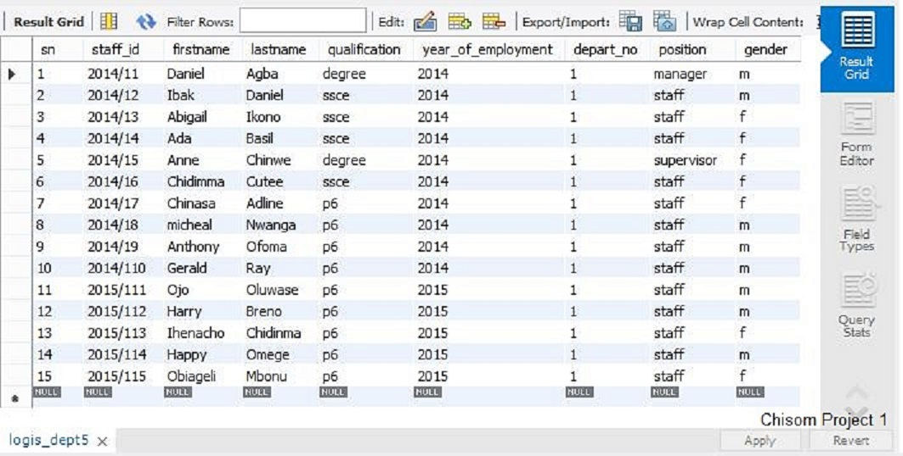

          SELECT * FROM ware_dept; 
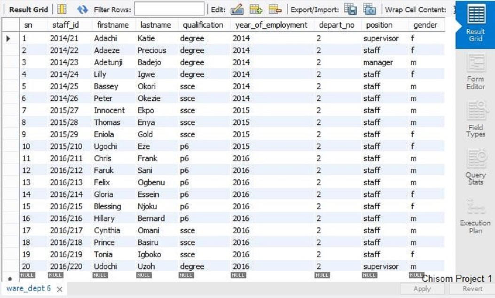

          SELECT * FROM prod_dept;
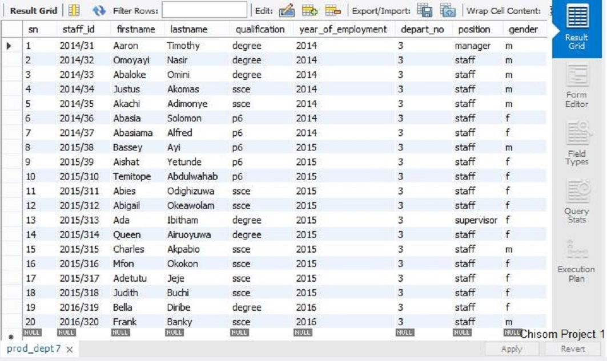

          SELECT * FROM hr_dept; 
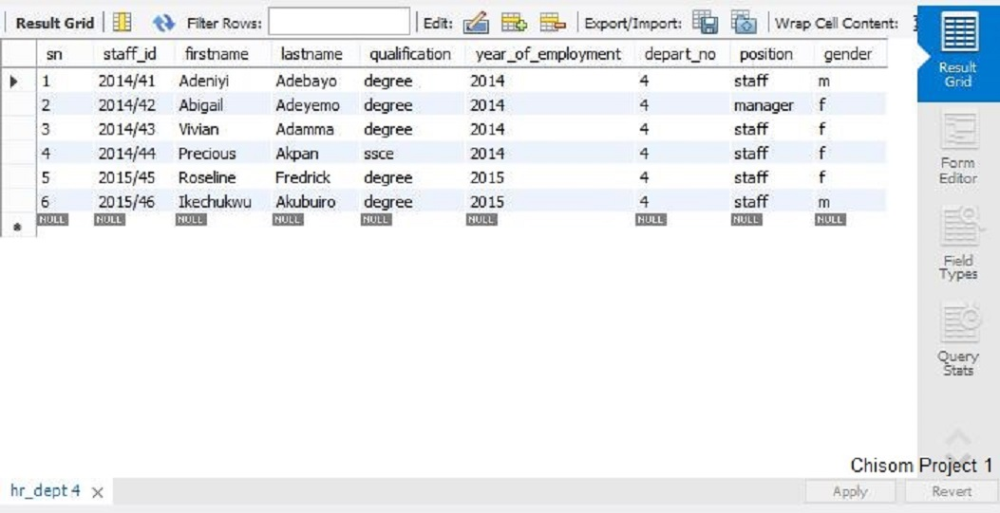

## Step 3

Creating payment record for each staff according to qualification and position

      CREATE TABLE payment_record 
      SELECT staff_id, firstname, lastname, position FROM logis_dept
      UNION
      SELECT staff_id, firstname, lastname, position FROM ware_dept
      UNION
      SELECT staff_id, firstname, lastname, position FROM prod_dept
      UNION
      SELECT staff_id, firstname, lastname, position FROM hr_dept
      ORDER BY staff_id;

      ALTER TABLE payment_record
      ADD sn INT NOT NULL AUTO_INCREMENT UNIQUE
      FIRST;

**NEXT,** creating a payment column for each staff in this table:

      ALTER TABLE payment_record
      ADD salary_amount DEC(14, 2) DEFAULT 0;

Hence, creating a procedure called ‘update payment’ to always update the salary amount for each staff. 

        DELIMITER //
        CREATE PROCEDURE update_payment1()
        BEGIN
        UPDATE payment_record
        SET salary_amount = 450000
        WHERE position = 'manager';
        END //

        DELIMITER //
        CREATE PROCEDURE update_payment2()
        BEGIN
        UPDATE payment_record
        SET salary_amount = 300000
        WHERE position = 'supervisor';
        END //

        DELIMITER //
        CREATE PROCEDURE update_payment3()
        BEGIN
        UPDATE payment_record
        SET salary_amount = 200000
        WHERE position = 'staff' AND qualification = 'degree';
        END //

        DELIMITER //
        CREATE PROCEDURE update_payment4()
        BEGIN
        UPDATE payment_record
        SET salary_amount = 150000
        WHERE position = 'staff' AND qualification = 'ssce';
        END //

        DELIMITER //
        CREATE PROCEDURE update_payment5()
        BEGIN
        UPDATE payment_record
        SET salary_amount = 100000
        WHERE position = 'staff' AND qualification = 'p6';
        END //

      DELIMITER //
      CREATE PROCEDURE update_payment()
      BEGIN
      CALL update_payment1();
      CALL update_payment2();
      CALL update_payment3();
      CALL update_payment4();
      CALL update_payment5();
      END //

So, any time at the end of the month, the salary of the staff is to be evaluated or a new staff is added to the records, the syntax below is used to update the salary_amount column of the payment_record table:

      CALL update_payment();

**NEXT,** Linking the staff record table across each department to the payment record’s table. 

linking logistic department table to payment record table

        DELIMITER //
        CREATE TRIGGER after_insert_logis_payment
        AFTER INSERT ON logis_dept FOR EACH ROW
        BEGIN
        REPLACE INTO payment_record
        VALUES (NEW.firstname, NEW.lastname, NEW.staff_id, NEW.position, NEW.qualification);
        END //

        DELIMITER //
        CREATE TRIGGER after_delete_logis_payment
        AFTER DELETE ON logis_dept FOR EACH ROW
        BEGIN
        UPDATE payment_record
        SET firstname = NULL,
                 lastname = NULL,
                  staff_id = NULL,
                   position = NULL,
                   qualification = NULL,
                  salary_amount = 0
        WHERE sn BETWEEN 1 AND 1000;
        END //

        DELIMITER //
        CREATE TRIGGER after_update_logis_payment
        AFTER UPDATE ON logis_dept FOR EACH ROW
        BEGIN
        UPDATE payment_record
        SET firstname = NEW.firstname,
               lastname = NEW.lastname,
               staff_id = NEW.staff_id,
               position = NEW.position,
               qualification = NEW.qualification
        WHERE sn BETWEEN 1 AND 1000;
        END //

linking warehouse department table to payment record table 

        DELIMITER //
        CREATE TRIGGER after_insert_ware_payment
        AFTER INSERT ON ware_dept FOR EACH ROW
        BEGIN
        REPLACE INTO payment_record
        VALUES (NEW.firstname, NEW.lastname, NEW.staff_id, NEW.position, NEW.qualification);
        END //

        DELIMITER //
        CREATE TRIGGER after_delete_ware_payment
        AFTER DELETE ON ware_dept FOR EACH ROW
        BEGIN
        UPDATE payment_record
        SET firstname = NULL,
                 lastname = NULL,
                  staff_id = NULL,
                   position = NULL,
                   qualification = NULL,
                  salary_amount = 0
        WHERE sn BETWEEN 1 AND 1000;
        END //

        DELIMITER //
        CREATE TRIGGER after_update_ware_payment
        AFTER UPDATE ON ware_dept FOR EACH ROW
        BEGIN
        UPDATE payment_record
        SET firstname = NEW.firstname,
               lastname = NEW.lastname,
               staff_id = NEW.staff_id,
               position = NEW.position,
               qualification = NEW.qualification
        WHERE sn BETWEEN 1 AND 1000;
        END //

linking Production department table to payment record table

        DELIMITER //
        CREATE TRIGGER after_insert_prod_payment
        AFTER INSERT ON prod_dept FOR EACH ROW
        BEGIN
        REPLACE INTO payment_record
        VALUES (NEW.firstname, NEW.lastname, NEW.staff_id, NEW.position, NEW.qualification);
        END //

        DELIMITER //
        CREATE TRIGGER after_delete_prod_payment
        AFTER DELETE ON prod_dept FOR EACH ROW
        BEGIN
        UPDATE payment_record
        SET firstname = NULL,
                 lastname = NULL,
                  staff_id = NULL,
                   position = NULL,
                   qualification = NULL,
                  salary_amount = 0
        WHERE sn BETWEEN 1 AND 1000;
        END //

        DELIMITER //
        CREATE TRIGGER after_update_prod_payment
        AFTER UPDATE ON prod_dept FOR EACH ROW
        BEGIN
        UPDATE payment_record
        SET firstname = NEW.firstname,
               lastname = NEW.lastname,
               staff_id = NEW.staff_id,
               position = NEW.position,
               qualification = NEW.qualification
        WHERE sn BETWEEN 1 AND 1000;
        END //

linking HR department table to payment record table

        DELIMITER //
        CREATE TRIGGER after_insert_hr_payment
        AFTER INSERT ON hr_dept FOR EACH ROW
        BEGIN
        REPLACE INTO payment_record
        VALUES (NEW.firstname, NEW.lastname, NEW.staff_id, NEW.position, NEW.qualification);
        END //

        DELIMITER //
        CREATE TRIGGER after_delete_hr_payment
        AFTER DELETE ON hr_dept FOR EACH ROW
        BEGIN
        UPDATE payment_record
        SET firstname = NULL,
                 lastname = NULL,
                  staff_id = NULL,
                   position = NULL,
                   qualification = NULL,
                  salary_amount = 0
        WHERE sn BETWEEN 1 AND 1000;
        END //

        DELIMITER //
        CREATE TRIGGER after_update_hr_payment
        AFTER UPDATE ON hr_dept FOR EACH ROW
        BEGIN
        UPDATE payment_record
        SET firstname = NEW.firstname,
               lastname = NEW.lastname,
               staff_id = NEW.staff_id,
               position = NEW.position,
               qualification = NEW.qualification
        WHERE sn BETWEEN 1 AND 1000;
        END //

The above syntax ensures that every staff of the organization about existing staff and any future staff will always have an update payment record. And the syntax also ensures that if any staff is disengaged and his/her profile deleted from their department table, that particular staff automatically seizes to have any payment record. Also the syntax ensures any promoted staff by position will automatically have their new salary assigned to them.

Viewing the payment record table:

      SELECT * FROM payment_record;
    
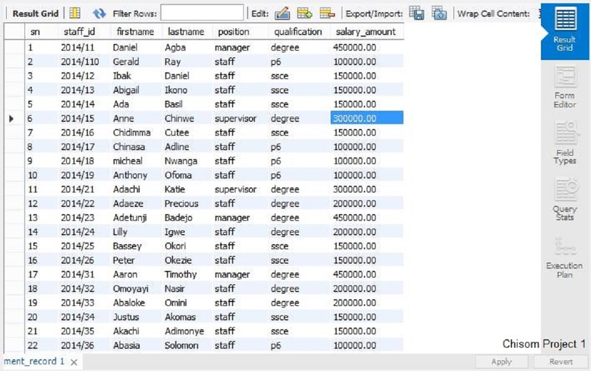           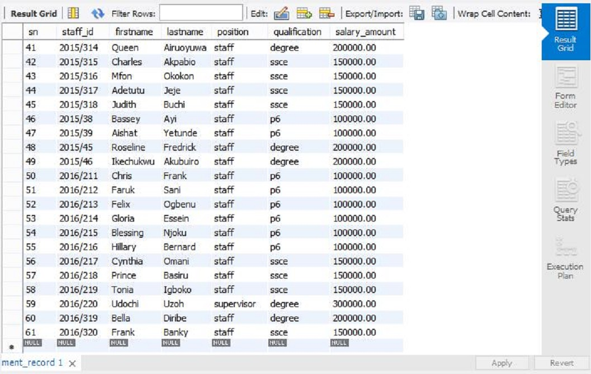 

**NEXT,** obtaining the total aggregate salary payment for the departments, along side with the individual department total payment salary:

creating a stored procedure called 'salary_payment’

        DELIMITER //
        CREATE PROCEDURE salary_payment()
        BEGIN
        SELECT SUM(salary_amount) AS Total_aggregate_salary, 
        (SELECT SUM(salary_amount) FROM payment_record
        WHERE staff_id LIKE '_____1%')
        AS Total_logis_dept_salary,
        (SELECT SUM(salary_amount) FROM payment_record
        WHERE staff_id LIKE '_____2%')
        AS Total_ware_dept_salary,
        (SELECT SUM(salary_amount) 
        FROM payment_record
        WHERE staff_id LIKE '_____3%') AS Total_prod_dept_salary, 
        (SELECT SUM(salary_amount) 
        FROM payment_record
        WHERE staff_id LIKE '_____4%') AS Total_hr_dept_salary
        FROM payment_record;
        END //

So at any time the Total salary by individual department and with the Total aggregate sum can be obtained using syntax below:

        CALL salary_payment() ;
        
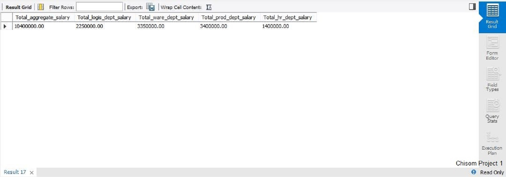

## Step 4 

Creating an Archive table record for all staff of the company.

        CREATE TABLE archive_record
        SELECT firstname, lastname, staff_id, depart_no, year_of_employment 
        FROM logis_dept
        UNION
        SELECT firstname, lastname, staff_id, depart_no, year_of_employment 
        FROM ware_dept
        UNION
        SELECT firstname, lastname, staff_id, depart_no, year_of_employment
        FROM prod_dept
        UNION
        SELECT firstname, lastname, staff_id, depart_no, year_of_employment
        FROM hr_dept
        ORDER BY depart_no, staff_id;

        ALTER TABLE archive_record
        ADD sn INT NOT NULL AUTO_INCREMENT UNIQUE
        FIRST;

        ALTER TABLE archive_record
        ADD employment_status VARCHAR(20) DEFAULT 'Active';

        ALTER TABLE archive_record
        ADD year_of_disengagement DATE DEFAULT NULL;

**NEXT,**  laying down triggers to ensure that whenever a new staff record is inserted into either logistic, warehouse, production or HR department table, such data entry is automatically entered into the Archive table for keeps. And such record can never be tampered with. 

using the ‘After Insert trigger’ for each department tables:

        DELIMITER //
        CREATE TRIGGER after_insert_logis_record
        AFTER INSERT ON logis_dept FOR EACH ROW
        BEGIN
        INSERT INTO archive_record VALUES (NEW.firstname, NEW.lastname, NEW.staff_id, NEW.depart_no, NEW.year_of_employment);
        END //

        DELIMITER //
        CREATE TRIGGER after_insert_ware_record
        AFTER INSERT ON ware_dept FOR EACH ROW
        BEGIN
        INSERT INTO archive_record VALUES (NEW.firstname, NEW.lastname, NEW.staff_id, NEW.depart_no, NEW.year_of_employment);
        END //

        DELIMITER //
        CREATE TRIGGER after_insert_prod_record
        AFTER INSERT ON prod_dept FOR EACH ROW
        BEGIN
        INSERT INTO archive_record VALUES (NEW.firstname, NEW.lastname, NEW.staff_id, NEW.depart_no, NEW.year_of_employment);
        END //

        DELIMITER //
        CREATE TRIGGER after_insert_hr_record
        AFTER INSERT ON hr_dept FOR EACH ROW
        BEGIN
        INSERT INTO archive_record VALUES (NEW.firstname, NEW.lastname, NEW.staff_id, NEW.depart_no, NEW.year_of_employment);
        END //

using the ‘After Delete trigger’ to update the staff employment status and the year disengaged:

      DELIMITER //
      CREATE TRIGGER after_delete_logis_record
      AFTER DELETE ON logis_dept FOR EACH ROW
      BEGIN 
      UPDATE archive_record
      SET employment_status = ‘disengaged’,
              year_of_disengagement = CURDATE
      WHERE sn BETWEEN 1 AND 1000;
      END//

      DELIMITER //
      CREATE TRIGGER after_delete_ware_record
      AFTER DELETE ON ware_dept FOR EACH ROW
      BEGIN 
      UPDATE archive_record
      SET employment_status = ‘disengaged’,
              year_of_disengagement = CURDATE 
      WHERE sn BETWEEN 1 AND 1000; 
      END //

      DELIMITER //
      CREATE TRIGGER after_delete_prod_record
      AFTER DELETE ON prod_dept FOR EACH ROW
      BEGIN 
      UPDATE archive_record
      SET employment_status = ‘disengaged’,
              year_of_disengagement = CURDATE 
      WHERE sn BETWEEN 1 AND 1000;
      END //

      DELIMITER //
      CREATE TRIGGER after_delete_hr_record
      AFTER DELETE ON hr_dept FOR EACH ROW
      BEGIN 
      UPDATE archive_record
      SET employment_status = ‘disengaged’,
              Year_of_disengagement = CURDATE 
      WHERE sn BETWEEN 1 AND 1000;
      END //

## Step 5

Testing the Database structure for accuracy and reliability of execution:

**Case 1:**

OBZ company just won a big contract to produce more beverages for their client for the next 20 years, and so the management sat and decided to increase their number of staff in the production and warehouse department. However, they intend to be gender sensitive, hence they want to know the ratio of male staff to female staff in the two department. 

So using the statement below obtains this statistical information: 

for Production department

        SELECT
        ( SELECT COUNT(gender)
        FROM prod_dept WHERE gender LIKE 'f')
        /
        (SELECT COUNT(gender)
        FROM prod_dept) * 100 AS 'female_percent',
        (SELECT COUNT(gender)
        FROM prod_dept WHERE gender LIKE 'm')
        /
        (SELECT COUNT(gender)
        FROM prod_dept) * 100 AS 'male_percent';

for warehouse department 

        SELECT
        (SELECT COUNT(gender)
        FROM ware_dept WHERE gender LIKE 'f')
        /
        (SELECT COUNT(gender)
        FROM ware_dept) * 100 AS 'female_percent',
        (SELECT COUNT(gender)
        FROM ware_dept WHERE gender LIKE 'm')
        /
        (SELECT COUNT(gender)
        FROM ware_dept) * 100 AS 'male_percent';

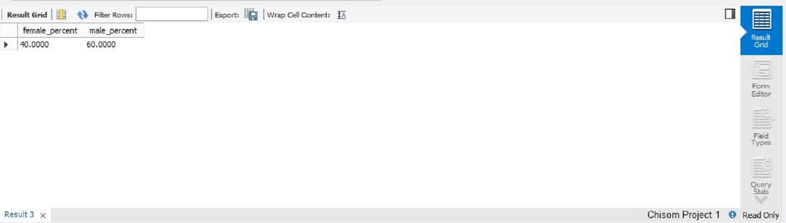

        SAVEPOINT my_saves;

Hence these statistics gives the bases on the number of males to female staffs to be recruited into the departments below.
So with the above statistical result, the following number of staff across gender lines is added to the two department.

For Production department

        INSERT INTO prod_dept (firstname, lastname, qualification, year_of_employment, position, gender)
        VALUES
          (‘Ibok’, ‘Daniel’, ‘degree’, 2022, ‘supervisor’, ‘m’),
          (‘Jeremiah’, ‘Useni’, ‘degree’, 2022, ‘staff’, ‘m’),
          (‘Kelechi’, ‘Nwanya’, ‘ssce’, 2022, ‘staff’, ‘m’),
          (‘Lawal’, ‘Mojisola’, ‘p6’, 2022, ‘staff’, ‘m’),
          (‘Umeh’, ‘Benson’, ‘p6’, 2022, ‘staff’, ‘m’),
          (‘Badmus’, ‘Legover’, ‘p6’, 2022, ‘staff’, ‘m’),
          (‘Chinwe’, ‘Anne’, ‘ssce’, 2022, ‘staff’, ‘f’),
          (‘Chiamaka’, ‘Nedu’, ‘ssce’, 2022, ‘staff’, ‘f’),
          (‘Bella’, ‘Diribe’, ‘p6’, 2022, ‘staff’, ‘f’),
          (‘Akunna’, ‘Chibor’, ‘p6’, 2022, ‘staff’, ‘f’);

 For Warehouse department
 
         INSERT INTO ware_dept (firstname, lastname, qualification, year_of_employment, position, gender)
         VALUES
            (‘Jane’, ‘Amusu’, ‘degree’, 2022, ‘staff’, ‘f’),
            (‘Joy’, ‘Ukpong’, ‘degree’, 2022, ‘supervisor’, ‘f’),
            (‘Prisca’, ‘Amae’, ‘ssce’, 2022, ‘staff’, ‘f’),
            (‘Peace’, ‘Etok’, ‘ssce’, 2022, ‘staff’, ‘f’),
            (‘Kechi’, ‘Ray’, ‘p6’, 2022, ‘staff’, ‘f’),
            (‘Glory’, ‘Nwoye’, ‘p6’, 2022, ‘staff’, ‘f’),
            (‘Festus’, ‘Anya’, ‘degree’, 2022, ‘staff’, ‘m’),
            (‘Ogochukwu’, ‘Buchi’,  ‘ssce’, 2022, ‘supervisor’, ‘m’),
            (‘John’, ‘Akwo’, ‘ssce’, 2022, ‘staff’, ‘m’),
            (‘Kelechi’, ‘Anyaiam’, ‘p6’, 2022, ‘staff’, ‘m’);

So, viewing the data entry for the two department:

For warehouse department

        SELECT * FROM ware_dept;

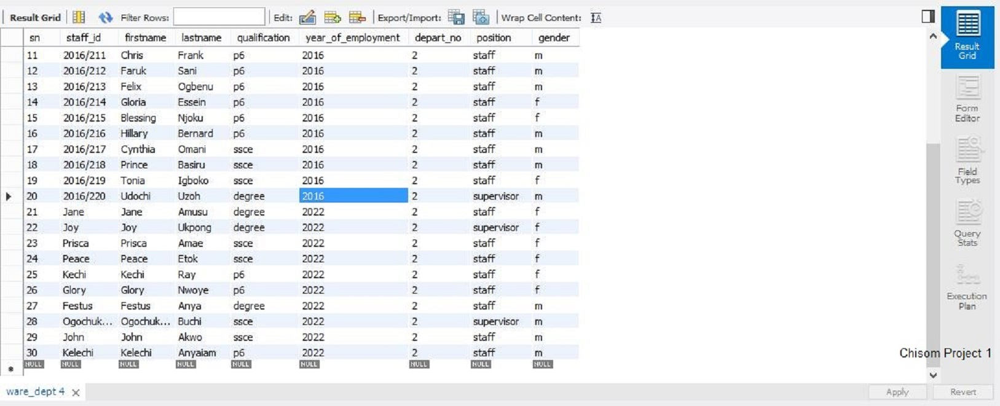

The new staff entry is from sn 21 to 30, and without staff Id. So assigning staff ID, we call the procedure;

        CALL update_staff_id_ware();

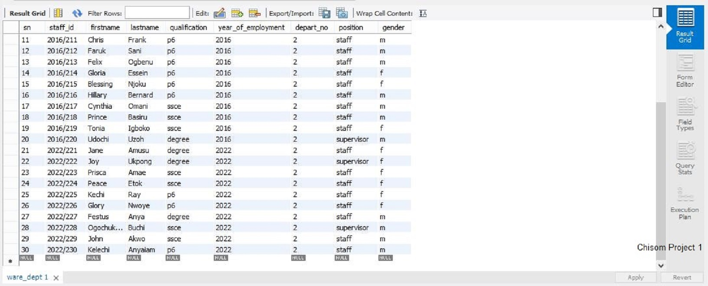

Now we see the new staff has automatically been given unique staff id 

For production department;

      SELECT * FROM prod_dept;

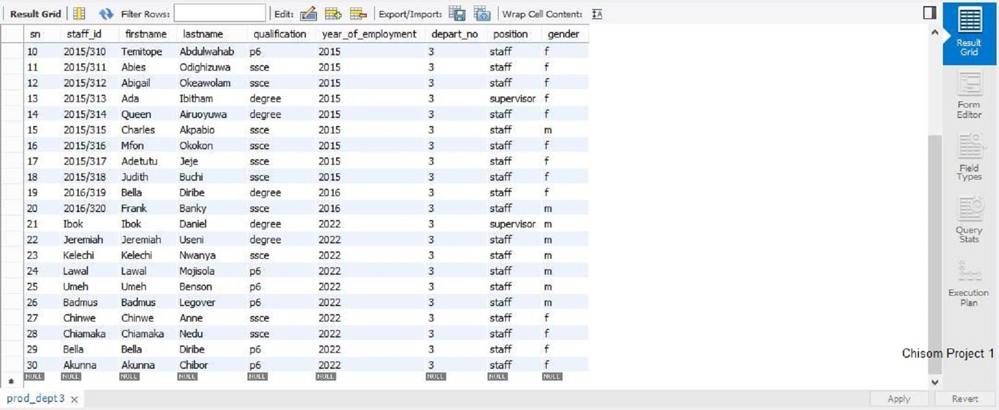

The new staff entry is from sn 21 to 30, and with no staff id. So assigning staff id, we call the procedure:

      CALL update_staff_id_prod();

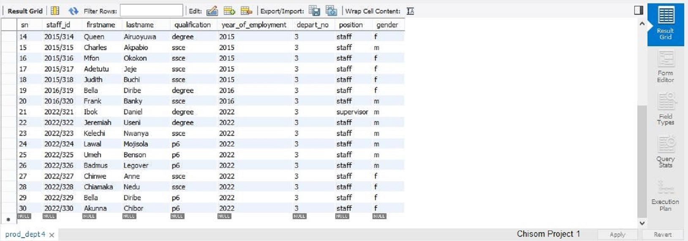

Now the new staffs have been given unique staff id numbers.

**NOTE:** This procedure can be automated of any number of staff with just a click of a button.

**NEXT,** checking the payment records for the new staff

          SELECT * FROM payment_record;

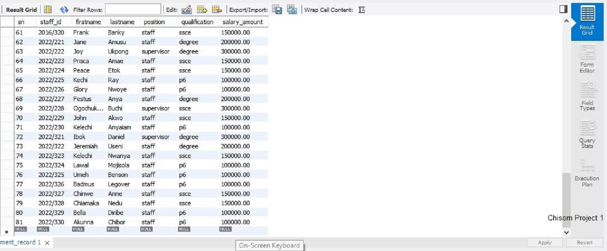

Now, we see the new staff profile have been automatically inserted into the payment records and their salary have been updated with regards to qualification and position held by the staff.

**NEXT,** checking the archive record for the new staff

              SELECT * FROM archive_record;

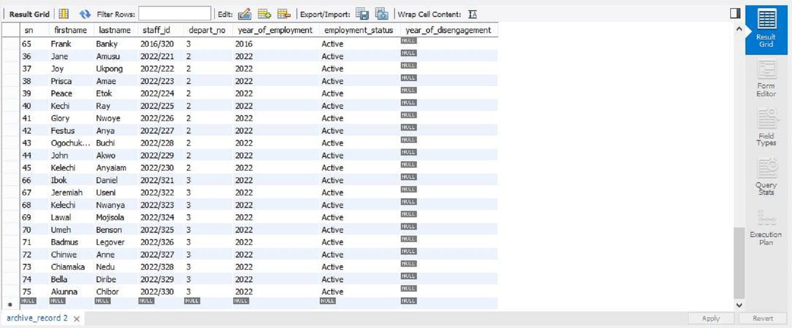

The new staff record was automatically updated into the archive record once it was inserted into the respective department tables. And this attest for accuracy of staff records audit trail.

##Conclusion:

The Database structure is efficient and accurate in maintaining staff records and payment porfolio. And this database structure can be used for any number of departments and any number of staff.

Thank you for reading through.

**NEXT:** I will put forward a porfolio on automated system of materials (goods) movement between procurement, production and warehouse department. 

